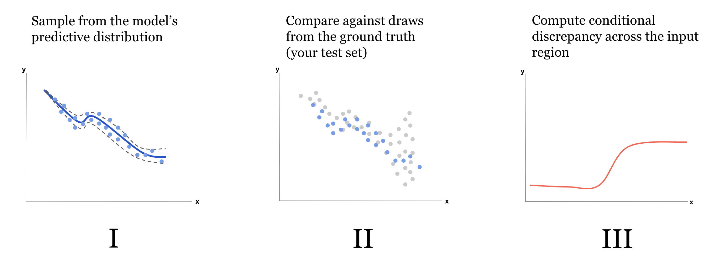

# Assessing the Probabilistic Fit of Neural Regressors

This repository contains the official implementation of the ECAI 2025 paper [Assessing the Probabilistic Fit of Neural Regressors via Conditional Congruence](https://arxiv.org/abs/2405.12412).

Authors: [Spencer Young*](https://spencermyoung513.github.io/), [Riley Sinema](https://www.linkedin.com/in/rileysinema), [Cole Edgren](https://www.linkedin.com/in/cole-edgren-464b96239), [Andrew Hall](https://www.linkedin.com/in/andrewhall1124), [Nathan Dong](https://www.linkedin.com/in/nathan-dong-3aaa61b3), and [Porter Jenkins](https://science.byu.edu/directory/porter-jenkins).

*Indicates corresponding author

## Overview

We introduce **Conditional Congruence Error** (CCE), a novel metric for evaluating the fit of a probabilistic regression model. CCE uses conditional kernel mean embeddings to estimate the distance, at any point, between a model's learned predictive distribution and the true data-generating distribution at any point in the input space. CCE can even be evaluated on *unlabeled inputs*, enabling robust assessment of a model's reliability on novel, unseen data.



## Important Links

Important figures used in the paper, along with the code that generated them, can be found in [this directory](probcal/figures).

Our implementations of the probabilistic neural networks referenced in the paper can be found in [this directory](probcal/models).

Saved model weights can be found [here](weights), and synthetic dataset files can be found [here](data). Configs to reproduce the models referenced in the paper are saved in the [configs](configs) directory.

## Setup

### Install Dependencies

```bash
conda create --name cce python=3.10
conda activate cce
pip install -r requirements.txt
```

### Reproducing Results

#### Training models

To train a probabilistic neural network, first fill out a config (using [this config](probcal/training/sample_train_config.yaml) as a template). Then, from the terminal, run

```bash
python probcal/training/train_model.py --config path/to/your/config.yaml
```

Logs / saved model weights will be found at the locations specified in your config.

**Training on Tabular Datasets**. If fitting a model on tabular data, the training script assumes the dataset will be stored locally in `.npz` files with `X_train`, `y_train`, `X_val`, `y_val`, `X_test`, and `y_test` splits. Pass a path to this `.npz` file in the `dataset` `path` key in the config (also ensure that the `dataset` `type` is set to `tabular` and the `dataset` `input_dim` key is properly specified).

#### Evaluating Models

To obtain evaluation metrics for a given model, first fill out a config (using [this config](probcal/evaluation/sample_eval_config.yaml) as a template).
Then, run the following command:

```bash
python probcal/evaluation/eval_model.py --config path/to/eval/config.yaml
```

Two results files will be saved to the `log_dir` you specify in your config:

- A `test_metrics.yaml` with metrics like MAE, RMSE, etc. and a summary of the probabilistic results (such as the mean CCE values for each specified trial)
- A `probabilistic_results.pt` file which can be loaded into a `ProbabilisticResults` object to see granular CCE and ECE results.

#### Measuring Probabilistic Fit

Once a `ProbabilisticRegressionNN` subclass is trained, its probabilistic fit can be measured on a dataset via the `CalibrationEvaluator`. Example usage:

```python
from probcal.data_modules import COCOPeopleDataModule
from probcal.enums import DatasetType
from probcal.evaluation import CalibrationEvaluator
from probcal.evaluation import CalibrationEvaluatorSettings
from probcal.models import GaussianNN


# You can customize the settings for the calibration computation.
settings = CalibrationEvaluatorSettings(
    dataset_type=DatasetType.IMAGE,
    cce_input_kernel="polynomial",
    cce_output_kernel="rbf",
    cce_lambda=0.1,
    cce_num_samples=1,
    ece_bins=50,
    ece_weights="frequency",
    ece_alpha=1,
    # etc.
)
evaluator = CalibrationEvaluator(settings)

model = GaussianNN.load_from_checkpoint("path/to/model.ckpt")

# You can use any lightning data module (preferably, the one with the dataset the model was trained on).
data_module = COCOPeopleDataModule(root_dir="data", batch_size=4, num_workers=0, persistent_workers=False)
results = evaluator(model=model, data_module=data_module)
results.save("path/to/results.npz")
```

Invoking the `CalibrationEvaluator`'s `__call__` method (as above) kicks off an extensive evaluation wherein calibration metrics are computed for the specified model. This passes back a `CalibrationResults` object, which will contain the computed metrics and other helpful variables for further analysis.

## Development

### Install Pre-Commit Hook

To install this repo's pre-commit hook with automatic linting and code quality checks, simply execute the following command:

```bash
pre-commit install
```

When you commit new code, the pre-commit hook will run a series of scripts to standardize formatting. There will also be a flake8 check that provides warnings about various Python styling violations. These must be resolved for the commit to go through. If you need to bypass the linters for a specific commit, add the `--no-verify` flag to your git commit command.

### Adding New Models

All regression models should inherit from the `ProbabilisticRegressionNN` class (found [here](probcal/models/probabilistic_regression_nn.py)). This base class is a `lightning` module, which allows for a lot of typical NN boilerplate code to be abstracted away. Beyond setting a few class attributes like `loss_fn` while calling the super-initializer, the only methods you need to actually write to make a new module are:

- `_forward_impl` (defines a forward pass through the network)
- `_predict_impl` (defines how to make predictions with the network, including any transformations on the output of the forward pass)
- `_sample_impl` (defines how to sample from the network's predictive distribution for a given input)
- `_rsample_impl` (defines how to sample with a differentiable relaxation from the predictive distribution)
- `_predictive_dist_impl` (defines how to produce a predictive distribution from network output)
- `_point_prediction_impl` (defines how to interpret network output as a single point prediction for a regression target)
- `_update_addl_test_metrics` (defines how to update additional metrics beyond rmse/mae for each test batch)
- `_log_addl_test_metrics` (defines how to log additional test metrics beyond rmse/mae after inference is done)

See existing model classes like `GaussianNN` (found [here](probcal/models/gaussian_nn.py)) for an example of these steps.

## Citations

If you find our work useful, please consider citing our paper:

```bibtex
@inproceedings{young2025cce,
  title={Assessing the Probabilistic Fit of Neural Regressors via Conditional Congruence},
  author={Young, Spencer and Sinema, Riley and Edgren, Cole and Hall, Andrew and Dong, Nathan and Jenkins, Porter},
  booktitle={28th European Conference on Artificial Intelligence},
  year={2025},
  month={October},
  abbr={ECAI 2025}
}
```
