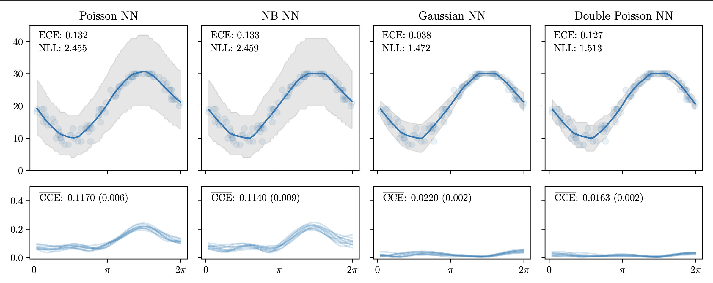
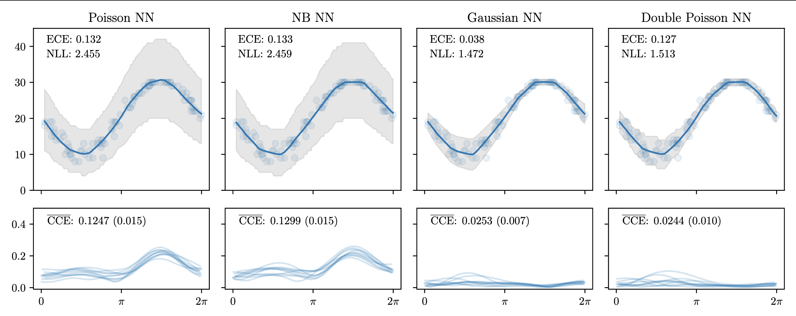
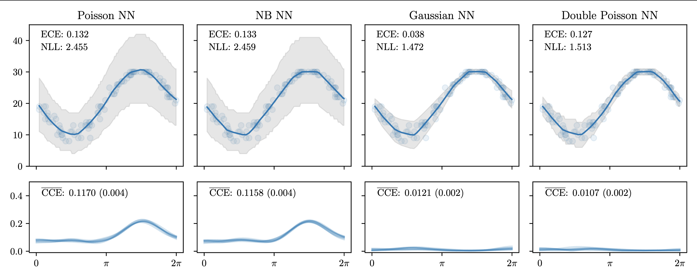

# Investigating the Variance of the CCE Estimate

Since the Conditional Congruence Error is an estimate that relies on sampling, we wish to investigate the impact of potential sources of variability.

## Variability due to Monte Carlo sampling

To make a single CCE computation, one must first obtain $\ell$ Monte Carlo samples from the model being evaluated. This means that multiple CCE computations may yield slightly different values. Expanding on the experiment outlined in Section 4.1, for each of the 4 models being evaluated, we compute 10 separate trials of the CCE computation. In each trial, we set $\ell=5$. We report results in a figure similar to Figure 2, where the bottom row depicting CCE values now shows the output of each CCE run. We report the mean and standard deviation (in parentheses) of $\overline{\text{CCE}}$ across all trials, and plot the CCE evaluations across the input grid:

## Variability due to repeated sampling from the same data-generating process

Since we can only estimate nature's true data-generating distribution from a dataset, the CCE values we compute will vary slightly when obtained from different data drawn from the same underlying process. To investigate the impact of this variability due to data, we draw 10 additional evaluation datasets of size $n=100$ from the same process used in Section 4.1. For each dataset (and each model being evaluated), we perform one CCE computation with $\ell = 5$. Results are displayed below, in a similar style as the figure in the [previous section](#variability-due-to-monte-carlo-sampling):

When we draw evaluation datasets with a larger number of samples ($n=1000$), we see the variation between computations decrease:

